## Project Overwiev

This machine learning project is designed to help East Village Productions classify their new songs into different genres in the best way possible. The project aims to identify the most important features of songs that can help with genre classification, and also provide insights into which features should be targeted to maximize profits.


## Data

The dataset used for this machine learning project is a Spotify dataset obtained from Kaggle, which contains 232,725 rows and 17 columns. The columns in the dataset are as follows:

acousticness(float number):
A confidence measure from 0.0 to 1.0 of whether the track is acoustic. 1.0 represents high confidence the track is acoustic.
\
\
danceability(float number): 
Danceability describes how suitable a track is for dancing based on a combination of musical elements including tempo, rhythm stability, beat strength, and overall regularity. A value of 0.0 is least danceable and 1.0 is most danceable.
\
\
duration_ms(integer): 
The duration of the track in milliseconds.
\
\
energy(float number): 
Energy is a measure from 0.0 to 1.0 and represents a perceptual measure of intensity and activity. Typically, energetic tracks feel fast, loud, and noisy. For example, death metal has high energy, while a Bach prelude scores low on the scale. Perceptual features contributing to this attribute include dynamic range, perceived loudness, timbre, onset rate, and general entropy.
\
\
id(string):
The Spotify ID for the track.
\
\
instrumentalness(float number): 
Predicts whether a track contains no vocals. "Ooh" and "aah" sounds are treated as instrumental in this context. Rap or spoken word tracks are clearly "vocal". The closer the instrumentalness value is to 1.0, the greater likelihood the track contains no vocal content. Values above 0.5 are intended to represent instrumental tracks, but confidence is higher as the value approaches 1.0.
\
\
key(integer): 
The key the track is in. Integers map to pitches using standard Pitch Class notation. E.g. 0 = C, 1 = C♯/D♭, 2 = D, and so on. If no key was detected, the value is -1.
\
\
liveness(float number): 
Detects the presence of an audience in the recording. Higher liveness values represent an increased probability that the track was performed live. A value above 0.8 provides strong likelihood that the track is live.
\
\
loudness(float number): 
The overall loudness of a track in decibels (dB). Loudness values are averaged across the entire track and are useful for comparing relative loudness of tracks. Loudness is the quality of a sound that is the primary psychological correlate of physical strength (amplitude). Values typically range between -60 and 0 db.
\
\
mode(integer):
Mode indicates the modality (major or minor) of a track, the type of scale from which its melodic content is derived. Major is represented by 1 and minor is 0.
\
\
speechiness(float number): 
Speechiness detects the presence of spoken words in a track. The more exclusively speech-like the recording (e.g. talk show, audio book, poetry), the closer to 1.0 the attribute value. Values above 0.66 describe tracks that are probably made entirely of spoken words. Values between 0.33 and 0.66 describe tracks that may contain both music and speech, either in sections or layered, including such cases as rap music. Values below 0.33 most likely represent music and other non-speech-like tracks.
\
\
tempo(float number): 
The overall estimated tempo of a track in beats per minute (BPM). In musical terminology, tempo is the speed or pace of a given piece and derives directly from the average beat duration.
\
\
time_signature(integer):
An estimated time signature. The time signature (meter) is a notational convention to specify how many beats are in each bar (or measure). The time signature ranges from 3 to 7 indicating time signatures of "3/4", to "7/4".
\
\
valence(float number): 
A measure from 0.0 to 1.0 describing the musical positiveness conveyed by a track. Tracks with high valence sound more positive (e.g. happy, cheerful, euphoric), while tracks with low valence sound more negative (e.g. sad, depressed, angry).
\
\
This dataset can be used to train a machine learning model to predict the genre of a song based on its features. The features in the dataset can also be analyzed to identify the most important ones for genre classification and for maximizing profits for East Village Productions.


## Project steps
The data modeling process involved an exploratory data analysis phase, followed by the creation of baseline models and more advanced models using pipelines and grid searches. The performance of these models was evaluated on a hold-out test set, and the best-performing model was identified for genre classification. Metric for this project is accuracy score.


```python
# Loading the required libraries
from pandas import read_csv
import pandas as pd
import matplotlib.pyplot as plt
import seaborn as sns
import numpy as np
from joypy import joyplot
from pandas.plotting import scatter_matrix
from matplotlib import pyplot
from sklearn.model_selection import train_test_split
from sklearn.model_selection import cross_val_score
from sklearn.model_selection import cross_val_predict
from sklearn.metrics import classification_report
from sklearn.metrics import confusion_matrix
from sklearn.model_selection import GridSearchCV
from sklearn.linear_model import LogisticRegression
from sklearn.tree import DecisionTreeClassifier
from sklearn.neighbors import KNeighborsClassifier
from sklearn.ensemble import GradientBoostingClassifier
from xgboost import XGBClassifier
from sklearn.preprocessing import OneHotEncoder, StandardScaler
from sklearn.compose import ColumnTransformer
from sklearn.ensemble import RandomForestClassifier
from sklearn.metrics import confusion_matrix, ConfusionMatrixDisplay
from sklearn.metrics import make_scorer, accuracy_score
from sklearn.pipeline import Pipeline
from sklearn import preprocessing
from sklearn.ensemble import StackingClassifier
import warnings
warnings.filterwarnings("ignore")
import pickle
from PIL import Image

```

## Initial Exploratory Data Analysis


In this chapter, I will perform a comprehensive EDA of the Spotify song features dataset, including investigation for any duplicate or null values, summary statistics, and correlation analysis. I will explore the distribution, range, and variability of each feature, as well as their relationships with each other and the target variable "Genre". The insights and observations from this EDA will help the upcoming steps in my project, such as selecting relevant features, preprocessing the data, and fine-tuning the model. This chapter will provide a comprehensive overview of the data, its characteristics, and its suitability for the genre classification task, as well as demonstrate the importance of EDA in the data science workflow.


```python
# Loading the dataset into a Pandas DataFrame from a CSV file
df = pd.read_csv('SpotifyFeatures.csv')

# Printing the first five rows of the DataFrame to check if the data was loaded correctly
df.head()
```


<div>
<style scoped>
    .dataframe tbody tr th:only-of-type {
        vertical-align: middle;
    }

    .dataframe tbody tr th {
        vertical-align: top;
    }

    .dataframe thead th {
        text-align: right;
    }
</style>
<table border="1" class="dataframe">
  <thead>
    <tr style="text-align: right;">
      <th></th>
      <th>genre</th>
      <th>artist_name</th>
      <th>track_name</th>
      <th>track_id</th>
      <th>popularity</th>
      <th>acousticness</th>
      <th>danceability</th>
      <th>duration_ms</th>
      <th>energy</th>
      <th>instrumentalness</th>
      <th>key</th>
      <th>liveness</th>
      <th>loudness</th>
      <th>mode</th>
      <th>speechiness</th>
      <th>tempo</th>
      <th>time_signature</th>
      <th>valence</th>
    </tr>
  </thead>
  <tbody>
    <tr>
      <th>0</th>
      <td>Movie</td>
      <td>Henri Salvador</td>
      <td>C'est beau de faire un Show</td>
      <td>0BRjO6ga9RKCKjfDqeFgWV</td>
      <td>0</td>
      <td>0.611</td>
      <td>0.389</td>
      <td>99373</td>
      <td>0.910</td>
      <td>0.000</td>
      <td>C#</td>
      <td>0.3460</td>
      <td>-1.828</td>
      <td>Major</td>
      <td>0.0525</td>
      <td>166.969</td>
      <td>4/4</td>
      <td>0.814</td>
    </tr>
    <tr>
      <th>1</th>
      <td>Movie</td>
      <td>Martin &amp; les fées</td>
      <td>Perdu d'avance (par Gad Elmaleh)</td>
      <td>0BjC1NfoEOOusryehmNudP</td>
      <td>1</td>
      <td>0.246</td>
      <td>0.590</td>
      <td>137373</td>
      <td>0.737</td>
      <td>0.000</td>
      <td>F#</td>
      <td>0.1510</td>
      <td>-5.559</td>
      <td>Minor</td>
      <td>0.0868</td>
      <td>174.003</td>
      <td>4/4</td>
      <td>0.816</td>
    </tr>
    <tr>
      <th>2</th>
      <td>Movie</td>
      <td>Joseph Williams</td>
      <td>Don't Let Me Be Lonely Tonight</td>
      <td>0CoSDzoNIKCRs124s9uTVy</td>
      <td>3</td>
      <td>0.952</td>
      <td>0.663</td>
      <td>170267</td>
      <td>0.131</td>
      <td>0.000</td>
      <td>C</td>
      <td>0.1030</td>
      <td>-13.879</td>
      <td>Minor</td>
      <td>0.0362</td>
      <td>99.488</td>
      <td>5/4</td>
      <td>0.368</td>
    </tr>
    <tr>
      <th>3</th>
      <td>Movie</td>
      <td>Henri Salvador</td>
      <td>Dis-moi Monsieur Gordon Cooper</td>
      <td>0Gc6TVm52BwZD07Ki6tIvf</td>
      <td>0</td>
      <td>0.703</td>
      <td>0.240</td>
      <td>152427</td>
      <td>0.326</td>
      <td>0.000</td>
      <td>C#</td>
      <td>0.0985</td>
      <td>-12.178</td>
      <td>Major</td>
      <td>0.0395</td>
      <td>171.758</td>
      <td>4/4</td>
      <td>0.227</td>
    </tr>
    <tr>
      <th>4</th>
      <td>Movie</td>
      <td>Fabien Nataf</td>
      <td>Ouverture</td>
      <td>0IuslXpMROHdEPvSl1fTQK</td>
      <td>4</td>
      <td>0.950</td>
      <td>0.331</td>
      <td>82625</td>
      <td>0.225</td>
      <td>0.123</td>
      <td>F</td>
      <td>0.2020</td>
      <td>-21.150</td>
      <td>Major</td>
      <td>0.0456</td>
      <td>140.576</td>
      <td>4/4</td>
      <td>0.390</td>
    </tr>
  </tbody>
</table>
</div>


```python

# Printing information about the DataFrame, including the data types of each column and the number of non-null values
df.info()

# Printing descriptive statistics of the numerical columns in the DataFrame, such as count, mean, std, min, max, and quartiles
df.describe()
```

    <class 'pandas.core.frame.DataFrame'>
    RangeIndex: 232725 entries, 0 to 232724
    Data columns (total 18 columns):
     #   Column            Non-Null Count   Dtype  
    ---  ------            --------------   -----  
     0   genre             232725 non-null  object 
     1   artist_name       232725 non-null  object 
     2   track_name        232725 non-null  object 
     3   track_id          232725 non-null  object 
     4   popularity        232725 non-null  int64  
     5   acousticness      232725 non-null  float64
     6   danceability      232725 non-null  float64
     7   duration_ms       232725 non-null  int64  
     8   energy            232725 non-null  float64
     9   instrumentalness  232725 non-null  float64
     10  key               232725 non-null  object 
     11  liveness          232725 non-null  float64
     12  loudness          232725 non-null  float64
     13  mode              232725 non-null  object 
     14  speechiness       232725 non-null  float64
     15  tempo             232725 non-null  float64
     16  time_signature    232725 non-null  object 
     17  valence           232725 non-null  float64
    dtypes: float64(9), int64(2), object(7)
    memory usage: 32.0+ MB


<div>
<style scoped>
    .dataframe tbody tr th:only-of-type {
        vertical-align: middle;
    }

    .dataframe tbody tr th {
        vertical-align: top;
    }

    .dataframe thead th {
        text-align: right;
    }
</style>
<table border="1" class="dataframe">
  <thead>
    <tr style="text-align: right;">
      <th></th>
      <th>popularity</th>
      <th>acousticness</th>
      <th>danceability</th>
      <th>duration_ms</th>
      <th>energy</th>
      <th>instrumentalness</th>
      <th>liveness</th>
      <th>loudness</th>
      <th>speechiness</th>
      <th>tempo</th>
      <th>valence</th>
    </tr>
  </thead>
  <tbody>
    <tr>
      <th>count</th>
      <td>232725.000000</td>
      <td>232725.000000</td>
      <td>232725.000000</td>
      <td>2.327250e+05</td>
      <td>232725.000000</td>
      <td>232725.000000</td>
      <td>232725.000000</td>
      <td>232725.000000</td>
      <td>232725.000000</td>
      <td>232725.000000</td>
      <td>232725.000000</td>
    </tr>
    <tr>
      <th>mean</th>
      <td>41.127502</td>
      <td>0.368560</td>
      <td>0.554364</td>
      <td>2.351223e+05</td>
      <td>0.570958</td>
      <td>0.148301</td>
      <td>0.215009</td>
      <td>-9.569885</td>
      <td>0.120765</td>
      <td>117.666585</td>
      <td>0.454917</td>
    </tr>
    <tr>
      <th>std</th>
      <td>18.189948</td>
      <td>0.354768</td>
      <td>0.185608</td>
      <td>1.189359e+05</td>
      <td>0.263456</td>
      <td>0.302768</td>
      <td>0.198273</td>
      <td>5.998204</td>
      <td>0.185518</td>
      <td>30.898907</td>
      <td>0.260065</td>
    </tr>
    <tr>
      <th>min</th>
      <td>0.000000</td>
      <td>0.000000</td>
      <td>0.056900</td>
      <td>1.538700e+04</td>
      <td>0.000020</td>
      <td>0.000000</td>
      <td>0.009670</td>
      <td>-52.457000</td>
      <td>0.022200</td>
      <td>30.379000</td>
      <td>0.000000</td>
    </tr>
    <tr>
      <th>25%</th>
      <td>29.000000</td>
      <td>0.037600</td>
      <td>0.435000</td>
      <td>1.828570e+05</td>
      <td>0.385000</td>
      <td>0.000000</td>
      <td>0.097400</td>
      <td>-11.771000</td>
      <td>0.036700</td>
      <td>92.959000</td>
      <td>0.237000</td>
    </tr>
    <tr>
      <th>50%</th>
      <td>43.000000</td>
      <td>0.232000</td>
      <td>0.571000</td>
      <td>2.204270e+05</td>
      <td>0.605000</td>
      <td>0.000044</td>
      <td>0.128000</td>
      <td>-7.762000</td>
      <td>0.050100</td>
      <td>115.778000</td>
      <td>0.444000</td>
    </tr>
    <tr>
      <th>75%</th>
      <td>55.000000</td>
      <td>0.722000</td>
      <td>0.692000</td>
      <td>2.657680e+05</td>
      <td>0.787000</td>
      <td>0.035800</td>
      <td>0.264000</td>
      <td>-5.501000</td>
      <td>0.105000</td>
      <td>139.054000</td>
      <td>0.660000</td>
    </tr>
    <tr>
      <th>max</th>
      <td>100.000000</td>
      <td>0.996000</td>
      <td>0.989000</td>
      <td>5.552917e+06</td>
      <td>0.999000</td>
      <td>0.999000</td>
      <td>1.000000</td>
      <td>3.744000</td>
      <td>0.967000</td>
      <td>242.903000</td>
      <td>1.000000</td>
    </tr>
  </tbody>
</table>
</div>


There are 18 columns and 232725 rows with different data types such as objects, integers and floats.


```python
# Checking for missing values in each column of the DataFrame and print the total number of missing values
df.isnull().sum()
```


    genre               0
    artist_name         0
    track_name          0
    track_id            0
    popularity          0
    acousticness        0
    danceability        0
    duration_ms         0
    energy              0
    instrumentalness    0
    key                 0
    liveness            0
    loudness            0
    mode                0
    speechiness         0
    tempo               0
    time_signature      0
    valence             0
    dtype: int64


```python
# Checking for duplicated rows in the DataFrame and print the total number of duplicates
df.duplicated().sum()
```


    0


No duplicate values or columns, but I need to check track_id column to see if there are duplicated tracks.


```python
duplicated_all = df[df.duplicated(subset = 'track_id', keep=False)]
duplicated = df[df.duplicated(subset = 'track_id', keep='first')]
print(f'''Unique Duplicates: {duplicated.shape[0]}
Total Duplicates: {duplicated_all.shape[0]}
Total Data: {df.shape[0]}
Duplicates %: {round(duplicated_all.shape[0]/df.shape[0]*100, 2)}''')
```

    Unique Duplicates: 55951
    Total Duplicates: 91075
    Total Data: 232725
    Duplicates %: 39.13


It looks like there is duplicate tracks under different genres.


```python
# Checking the total number of target variables.
df['genre'].value_counts()
```


    Comedy              9681
    Soundtrack          9646
    Indie               9543
    Jazz                9441
    Pop                 9386
    Electronic          9377
    Children’s Music    9353
    Folk                9299
    Hip-Hop             9295
    Rock                9272
    Alternative         9263
    Classical           9256
    Rap                 9232
    World               9096
    Soul                9089
    Blues               9023
    R&B                 8992
    Anime               8936
    Reggaeton           8927
    Ska                 8874
    Reggae              8771
    Dance               8701
    Country             8664
    Opera               8280
    Movie               7806
    Children's Music    5403
    A Capella            119
    Name: genre, dtype: int64


26 Genres total, that's a lot! Also Children's Music and A Capalla doesn't have enough rows. Let's try to filter the genres for better results.


```python
# Creating a list for broad genres.
maingenres = ['Indie','Jazz','Pop','Electronic','Hip-Hop','Rock','Alternative','Classical','Rap', 'Soul','Blues','R&B','Country']
```


```python
# Filtering the dataframe with most broad genres.
loc_cond = [(x in maingenres) for x in df.genre]
df_main = df.loc[loc_cond]
```


```python
# Checking data to investigate if there is an imbalance between my targets.
df_main['genre'].value_counts(normalize=True)
```


    Indie          0.079636
    Jazz           0.078785
    Pop            0.078326
    Electronic     0.078251
    Hip-Hop        0.077566
    Rock           0.077374
    Alternative    0.077299
    Classical      0.077241
    Rap            0.077041
    Soul           0.075847
    Blues          0.075296
    R&B            0.075038
    Country        0.072301
    Name: genre, dtype: float64


After investigation, safe to say that targets are balanced.


```python
duplicated_all = df_main[df_main.duplicated(subset = 'track_id', keep=False)]
duplicated = df_main[df_main.duplicated(subset = 'track_id', keep='first')]
print(f'''Unique Duplicates: {duplicated.shape[0]}
Total Duplicates: {duplicated_all.shape[0]}
Total Data: {df_main.shape[0]}
Duplicates %: {round(duplicated_all.shape[0]/df_main.shape[0]*100, 2)}''')
```

    Unique Duplicates: 32072
    Total Duplicates: 54759
    Total Data: 119833
    Duplicates %: 45.7


 There are duplicates, I'm going to drop duplicates in order to avoid confusion.


```python
# Dropping duplicates from the latest dataframe.
df_clear = df_main.drop_duplicates(subset = 'track_id')
```


```python
duplicated_all = df_clear[df_clear.duplicated(subset = 'track_id', keep=False)]
duplicated = df_clear[df_clear.duplicated(subset = 'track_id', keep='first')]
print(f'''Unique Duplicates: {duplicated.shape[0]}
Total Duplicates: {duplicated_all.shape[0]}
Total Data: {df_clear.shape[0]}
Duplicates %: {round(duplicated_all.shape[0]/df_clear.shape[0]*100, 2)}''')
```

    Unique Duplicates: 0
    Total Duplicates: 0
    Total Data: 87761
    Duplicates %: 0.0


```python
df_clear['track_id'].duplicated().sum()
```


    0


Alright! It looks like there isn't any duplicate tracks in the dataframe.

### Removing columns that are not needed for genre classification

Let's check the column types to see the datatypes which will help me to use as predictors.


```python
# Checking column types.
df_clear.dtypes
```


    genre                object
    artist_name          object
    track_name           object
    track_id             object
    popularity            int64
    acousticness        float64
    danceability        float64
    duration_ms           int64
    energy              float64
    instrumentalness    float64
    key                  object
    liveness            float64
    loudness            float64
    mode                 object
    speechiness         float64
    tempo               float64
    time_signature       object
    valence             float64
    dtype: object


Artist name, track name and track id are not going to help in genre prediction, therefore I'm dropping them.


```python
df_class = df_clear.drop(columns=['artist_name','track_name','track_id'])
```

## Running the base models

##### Train test split


```python
# I'm defining my target column y and predictor columns X
y = df_class['genre']
X = df_class.drop(columns='genre')
```


```python
X_train, X_test, y_train, y_test = train_test_split(X,y,random_state=10)
```

#### Encoding the categorical data to numerical data and creating a pipeline

Next, I am going to use a pipeline encode my data and run my first models to start predicting!
I will create 2 seperate pipelines and use logistic regression in first one and random forest classifier in second one.


```python
# Creating seperate lists for categorical and numerical columns
cat_cols = ['key', 'mode','time_signature']
num_cols = ['acousticness', 'danceability', 'duration_ms', 'energy', 'instrumentalness',
            'liveness', 'loudness', 'speechiness', 'tempo', 'valence']

# Defining the column transformer for one-hot encoding categorical columns
preprocessor = ColumnTransformer(
    transformers=[
        ('cat', OneHotEncoder(handle_unknown='ignore'), cat_cols),('num', StandardScaler(), num_cols)], remainder='passthrough')

# Defining the pipeline with preprocessor and logistic regression classifier
pipe = Pipeline([
    ('preprocessor', preprocessor),
    ('clf', LogisticRegression())
])

# Fitting the pipeline on the training data
pipe.fit(X_train, y_train)

# Making predictions on the test data
y_pred = pipe.predict(X_test)

# Evaluating the performance of the model on the test data
print("Validation score ", cross_val_score(pipe,X_train,y_train).mean())
print('Accuracy:', accuracy_score(y_pred,y_test))
```

    Validation score  0.463111516256457
    Accuracy: 0.4767330568342373


```python
# Defining the second pipeline with preprocessor and random forest classifier
pipe = Pipeline([
    ('preprocessor', preprocessor),
    ('classifier', RandomForestClassifier())
])

# Fitting the pipeline on the training data
pipe.fit(X_train, y_train)

# Using the fitted pipeline to make predictions on the test data
y_pred = pipe.predict(X_test)

# Computing the validation and accuracy score on the test data
score = pipe.score(X_test, y_test)
print("Validation score ", cross_val_score(pipe,X_train,y_train).mean())
print('Accuracy:', accuracy_score(y_pred,y_test))

```

    Validation score  0.5458067456700091
    Accuracy: 0.549428011485347


```python
# Creating a confusion matrix to visualize my model's classifications.
ConfusionMatrixDisplay.from_estimator(pipe, X_test,y_test,xticks_rotation='vertical')
plt.show()
```


    
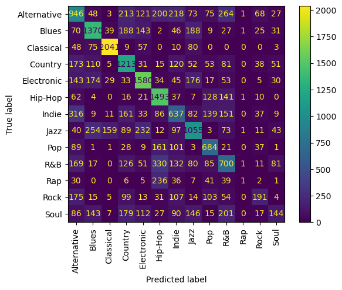
    


#### Initial model summary
I tried to classify 13 genres and my models are not doing great, they are working on 47% and 54% accuracy respectively. I will try to reduce my target classses to create a better model. I can go with top 5 most broad and popular genres for my new data.

## EDA & Predictor models with 5 target genres
In this part, I will create 6 different pipelines with different classifiers to get the best validation score.
Classifiers will be as following:
-Logistic Regression
-K Nearest Neighbors
-Decision Tree
-Gradient Boosting
-Extreme Gradient Boosting(XG Boost)

Along the way, I will use hyperparameter tuning to improve my accuracy scores. With the help of GridSearchCV I could try different hyperparameters to see which hyperparameters works best for my data.

### Let's focus on 5 genres this time


```python
# Creating a new list for top 5 genres
reducedgenres = ['Pop','Electronic','Hip-Hop','Rock','Classical']

# Creating a filtered dataframe with 5 genres
loc_cond = [(x in reducedgenres) for x in df.genre]
df_reduced = df.loc[loc_cond]
```


```python
# Below columns has no direct impact to genres, so I will go ahead and drop them
df_reduced = df_reduced.drop(columns=['artist_name','track_name','track_id','time_signature'])
```

### Checking for multicollinearity and more EDA to understand my targets better
This part I will dig into more EDA to see if I can find differences and similarities between genres by the features. I will also check for multicollinearty by creating a heatmap to see if I need to take action about it.


```python
# Checking the new dataframe
df_reduced
```


<div>
<style scoped>
    .dataframe tbody tr th:only-of-type {
        vertical-align: middle;
    }

    .dataframe tbody tr th {
        vertical-align: top;
    }

    .dataframe thead th {
        text-align: right;
    }
</style>
<table border="1" class="dataframe">
  <thead>
    <tr style="text-align: right;">
      <th></th>
      <th>genre</th>
      <th>popularity</th>
      <th>acousticness</th>
      <th>danceability</th>
      <th>duration_ms</th>
      <th>energy</th>
      <th>instrumentalness</th>
      <th>key</th>
      <th>liveness</th>
      <th>loudness</th>
      <th>mode</th>
      <th>speechiness</th>
      <th>tempo</th>
      <th>valence</th>
    </tr>
  </thead>
  <tbody>
    <tr>
      <th>22169</th>
      <td>Electronic</td>
      <td>96</td>
      <td>0.153000</td>
      <td>0.841</td>
      <td>212500</td>
      <td>0.798</td>
      <td>0.000003</td>
      <td>C#</td>
      <td>0.0618</td>
      <td>-4.206</td>
      <td>Minor</td>
      <td>0.2290</td>
      <td>95.948</td>
      <td>0.591</td>
    </tr>
    <tr>
      <th>22170</th>
      <td>Electronic</td>
      <td>82</td>
      <td>0.077100</td>
      <td>0.652</td>
      <td>205947</td>
      <td>0.713</td>
      <td>0.000010</td>
      <td>G#</td>
      <td>0.1440</td>
      <td>-5.311</td>
      <td>Major</td>
      <td>0.0368</td>
      <td>100.023</td>
      <td>0.152</td>
    </tr>
    <tr>
      <th>22171</th>
      <td>Electronic</td>
      <td>70</td>
      <td>0.074200</td>
      <td>0.536</td>
      <td>192000</td>
      <td>0.879</td>
      <td>0.000000</td>
      <td>C#</td>
      <td>0.0847</td>
      <td>-3.019</td>
      <td>Major</td>
      <td>0.0621</td>
      <td>140.137</td>
      <td>0.334</td>
    </tr>
    <tr>
      <th>22172</th>
      <td>Electronic</td>
      <td>78</td>
      <td>0.020300</td>
      <td>0.586</td>
      <td>220573</td>
      <td>0.701</td>
      <td>0.000000</td>
      <td>C#</td>
      <td>0.0550</td>
      <td>-5.326</td>
      <td>Minor</td>
      <td>0.0416</td>
      <td>104.957</td>
      <td>0.254</td>
    </tr>
    <tr>
      <th>22173</th>
      <td>Electronic</td>
      <td>73</td>
      <td>0.000726</td>
      <td>0.793</td>
      <td>450800</td>
      <td>0.703</td>
      <td>0.880000</td>
      <td>C</td>
      <td>0.0750</td>
      <td>-9.548</td>
      <td>Major</td>
      <td>0.0581</td>
      <td>130.270</td>
      <td>0.856</td>
    </tr>
    <tr>
      <th>...</th>
      <td>...</td>
      <td>...</td>
      <td>...</td>
      <td>...</td>
      <td>...</td>
      <td>...</td>
      <td>...</td>
      <td>...</td>
      <td>...</td>
      <td>...</td>
      <td>...</td>
      <td>...</td>
      <td>...</td>
      <td>...</td>
    </tr>
    <tr>
      <th>226503</th>
      <td>Rock</td>
      <td>58</td>
      <td>0.670000</td>
      <td>0.718</td>
      <td>136067</td>
      <td>0.593</td>
      <td>0.000000</td>
      <td>C</td>
      <td>0.1720</td>
      <td>-9.976</td>
      <td>Major</td>
      <td>0.0377</td>
      <td>124.251</td>
      <td>0.869</td>
    </tr>
    <tr>
      <th>226504</th>
      <td>Rock</td>
      <td>60</td>
      <td>0.034000</td>
      <td>0.521</td>
      <td>215973</td>
      <td>0.933</td>
      <td>0.000021</td>
      <td>B</td>
      <td>0.3300</td>
      <td>-4.874</td>
      <td>Minor</td>
      <td>0.1790</td>
      <td>169.842</td>
      <td>0.607</td>
    </tr>
    <tr>
      <th>226505</th>
      <td>Rock</td>
      <td>59</td>
      <td>0.671000</td>
      <td>0.618</td>
      <td>194000</td>
      <td>0.769</td>
      <td>0.241000</td>
      <td>B</td>
      <td>0.2760</td>
      <td>-4.642</td>
      <td>Minor</td>
      <td>0.0309</td>
      <td>111.978</td>
      <td>0.607</td>
    </tr>
    <tr>
      <th>226506</th>
      <td>Rock</td>
      <td>51</td>
      <td>0.054300</td>
      <td>0.681</td>
      <td>209893</td>
      <td>0.662</td>
      <td>0.005120</td>
      <td>G#</td>
      <td>0.2060</td>
      <td>-6.526</td>
      <td>Major</td>
      <td>0.1150</td>
      <td>149.485</td>
      <td>0.850</td>
    </tr>
    <tr>
      <th>226507</th>
      <td>Rock</td>
      <td>55</td>
      <td>0.385000</td>
      <td>0.493</td>
      <td>280947</td>
      <td>0.461</td>
      <td>0.000333</td>
      <td>B</td>
      <td>0.0985</td>
      <td>-9.777</td>
      <td>Minor</td>
      <td>0.0336</td>
      <td>140.049</td>
      <td>0.286</td>
    </tr>
  </tbody>
</table>
<p>46586 rows × 14 columns</p>
</div>


```python
# I will create visualizations from my numerical categories. Checking column types.
df_reduced.dtypes
```


    genre                object
    popularity            int64
    acousticness        float64
    danceability        float64
    duration_ms           int64
    energy              float64
    instrumentalness    float64
    key                  object
    liveness            float64
    loudness            float64
    mode                 object
    speechiness         float64
    tempo               float64
    valence             float64
    dtype: object


```python
# Creating seperate lists for categorical and numerical columns.
cat_cols = ['key', 'mode']
num_cols = ['acousticness', 'danceability', 'duration_ms', 'energy', 'instrumentalness',
            'liveness', 'loudness', 'speechiness', 'tempo', 'valence','popularity']
```


```python
# Creating another dataframe with numeric columns.
df_numeric = df_reduced[['genre','acousticness', 'danceability', 'duration_ms', 'energy', 'instrumentalness','liveness', 'loudness', 'speechiness', 'tempo', 'valence','popularity']]
df_numeric
```


<div>
<style scoped>
    .dataframe tbody tr th:only-of-type {
        vertical-align: middle;
    }

    .dataframe tbody tr th {
        vertical-align: top;
    }

    .dataframe thead th {
        text-align: right;
    }
</style>
<table border="1" class="dataframe">
  <thead>
    <tr style="text-align: right;">
      <th></th>
      <th>genre</th>
      <th>acousticness</th>
      <th>danceability</th>
      <th>duration_ms</th>
      <th>energy</th>
      <th>instrumentalness</th>
      <th>liveness</th>
      <th>loudness</th>
      <th>speechiness</th>
      <th>tempo</th>
      <th>valence</th>
      <th>popularity</th>
    </tr>
  </thead>
  <tbody>
    <tr>
      <th>22169</th>
      <td>Electronic</td>
      <td>0.153000</td>
      <td>0.841</td>
      <td>212500</td>
      <td>0.798</td>
      <td>0.000003</td>
      <td>0.0618</td>
      <td>-4.206</td>
      <td>0.2290</td>
      <td>95.948</td>
      <td>0.591</td>
      <td>96</td>
    </tr>
    <tr>
      <th>22170</th>
      <td>Electronic</td>
      <td>0.077100</td>
      <td>0.652</td>
      <td>205947</td>
      <td>0.713</td>
      <td>0.000010</td>
      <td>0.1440</td>
      <td>-5.311</td>
      <td>0.0368</td>
      <td>100.023</td>
      <td>0.152</td>
      <td>82</td>
    </tr>
    <tr>
      <th>22171</th>
      <td>Electronic</td>
      <td>0.074200</td>
      <td>0.536</td>
      <td>192000</td>
      <td>0.879</td>
      <td>0.000000</td>
      <td>0.0847</td>
      <td>-3.019</td>
      <td>0.0621</td>
      <td>140.137</td>
      <td>0.334</td>
      <td>70</td>
    </tr>
    <tr>
      <th>22172</th>
      <td>Electronic</td>
      <td>0.020300</td>
      <td>0.586</td>
      <td>220573</td>
      <td>0.701</td>
      <td>0.000000</td>
      <td>0.0550</td>
      <td>-5.326</td>
      <td>0.0416</td>
      <td>104.957</td>
      <td>0.254</td>
      <td>78</td>
    </tr>
    <tr>
      <th>22173</th>
      <td>Electronic</td>
      <td>0.000726</td>
      <td>0.793</td>
      <td>450800</td>
      <td>0.703</td>
      <td>0.880000</td>
      <td>0.0750</td>
      <td>-9.548</td>
      <td>0.0581</td>
      <td>130.270</td>
      <td>0.856</td>
      <td>73</td>
    </tr>
    <tr>
      <th>...</th>
      <td>...</td>
      <td>...</td>
      <td>...</td>
      <td>...</td>
      <td>...</td>
      <td>...</td>
      <td>...</td>
      <td>...</td>
      <td>...</td>
      <td>...</td>
      <td>...</td>
      <td>...</td>
    </tr>
    <tr>
      <th>226503</th>
      <td>Rock</td>
      <td>0.670000</td>
      <td>0.718</td>
      <td>136067</td>
      <td>0.593</td>
      <td>0.000000</td>
      <td>0.1720</td>
      <td>-9.976</td>
      <td>0.0377</td>
      <td>124.251</td>
      <td>0.869</td>
      <td>58</td>
    </tr>
    <tr>
      <th>226504</th>
      <td>Rock</td>
      <td>0.034000</td>
      <td>0.521</td>
      <td>215973</td>
      <td>0.933</td>
      <td>0.000021</td>
      <td>0.3300</td>
      <td>-4.874</td>
      <td>0.1790</td>
      <td>169.842</td>
      <td>0.607</td>
      <td>60</td>
    </tr>
    <tr>
      <th>226505</th>
      <td>Rock</td>
      <td>0.671000</td>
      <td>0.618</td>
      <td>194000</td>
      <td>0.769</td>
      <td>0.241000</td>
      <td>0.2760</td>
      <td>-4.642</td>
      <td>0.0309</td>
      <td>111.978</td>
      <td>0.607</td>
      <td>59</td>
    </tr>
    <tr>
      <th>226506</th>
      <td>Rock</td>
      <td>0.054300</td>
      <td>0.681</td>
      <td>209893</td>
      <td>0.662</td>
      <td>0.005120</td>
      <td>0.2060</td>
      <td>-6.526</td>
      <td>0.1150</td>
      <td>149.485</td>
      <td>0.850</td>
      <td>51</td>
    </tr>
    <tr>
      <th>226507</th>
      <td>Rock</td>
      <td>0.385000</td>
      <td>0.493</td>
      <td>280947</td>
      <td>0.461</td>
      <td>0.000333</td>
      <td>0.0985</td>
      <td>-9.777</td>
      <td>0.0336</td>
      <td>140.049</td>
      <td>0.286</td>
      <td>55</td>
    </tr>
  </tbody>
</table>
<p>46586 rows × 12 columns</p>
</div>


### Visualizations for EDA on 5 target genres vs features


```python
# Creating distplot for each numerical variable to visualize differences and similarities between genres.

for col in df_numeric.columns[1:]:
    sns.displot(data=df_numeric, x=col, hue="genre", kind="kde",color="olive", legend=True)
    sns.set(style="darkgrid")
    plt.show()
```


    
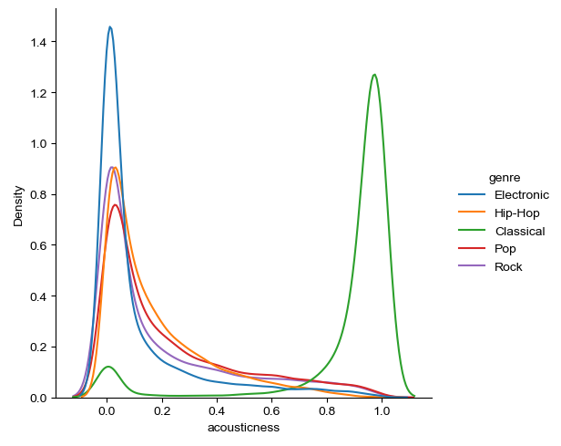
    


    
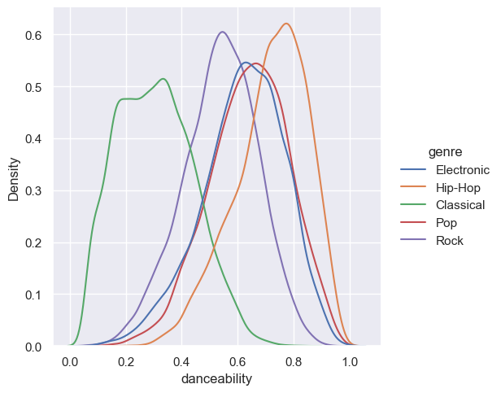
    


    
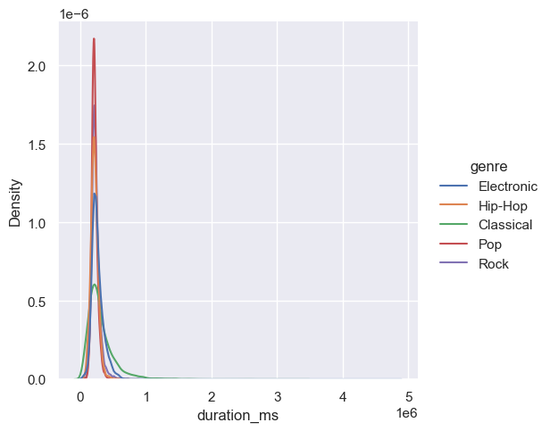
    


    
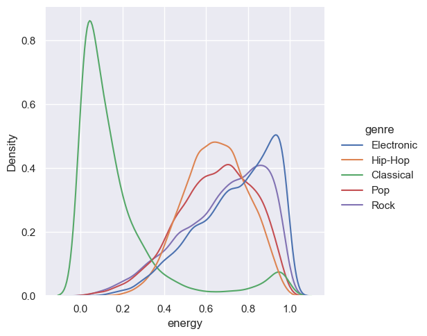
    


    
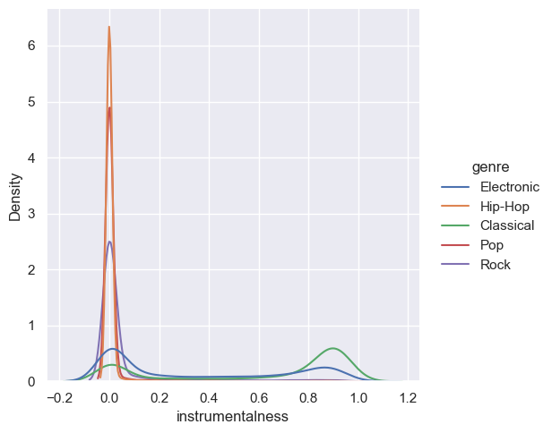
    


    
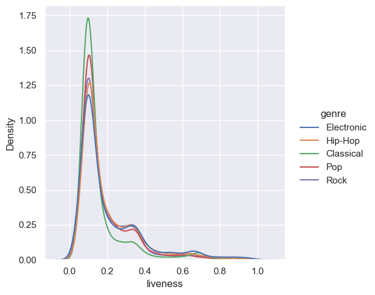
    


    
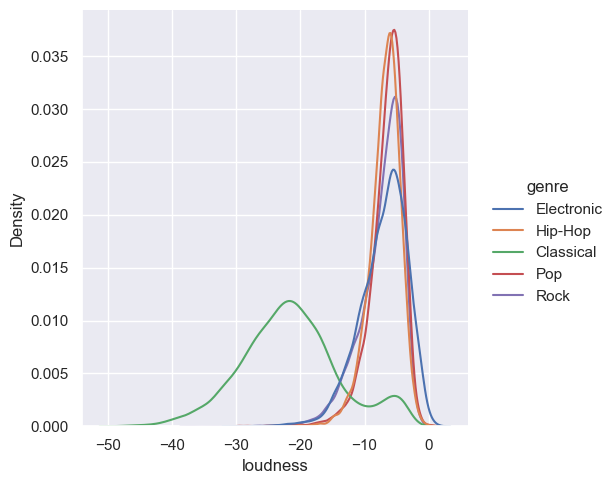
    


    
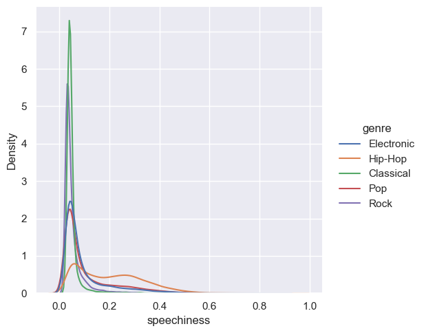
    


    
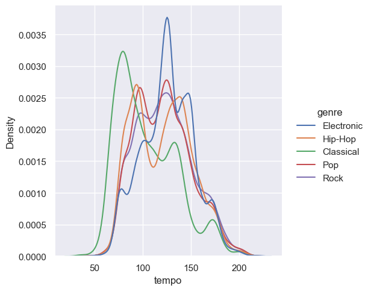
    


    
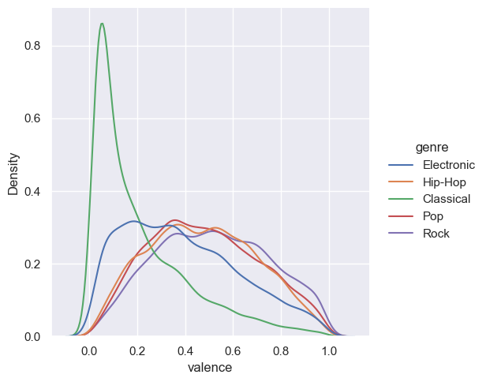
    


    
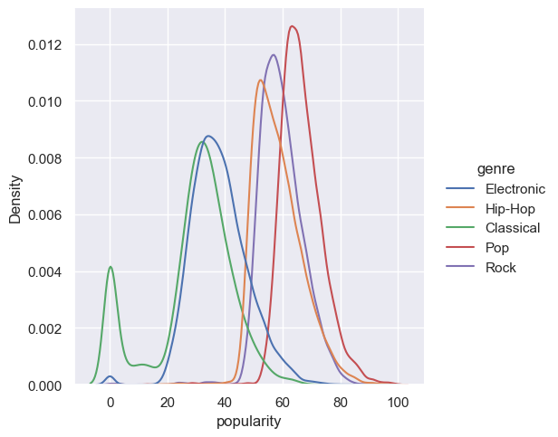
    


```python
# Creating the heatmap to check for multicollinearity
sns.heatmap(df_reduced.corr(), cmap='Blues')
```


    <AxesSubplot: >


    
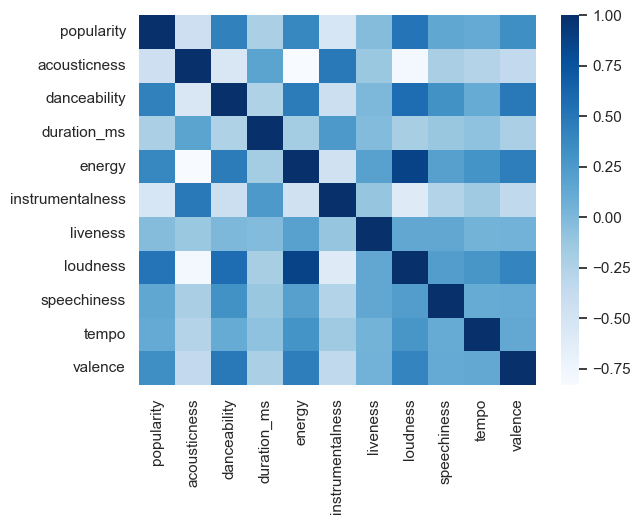
    


```python
# Checking the correlation coefficients to investigate possible multicollinearity.
df_numeric.corr()
```


<div>
<style scoped>
    .dataframe tbody tr th:only-of-type {
        vertical-align: middle;
    }

    .dataframe tbody tr th {
        vertical-align: top;
    }

    .dataframe thead th {
        text-align: right;
    }
</style>
<table border="1" class="dataframe">
  <thead>
    <tr style="text-align: right;">
      <th></th>
      <th>acousticness</th>
      <th>danceability</th>
      <th>duration_ms</th>
      <th>energy</th>
      <th>instrumentalness</th>
      <th>liveness</th>
      <th>loudness</th>
      <th>speechiness</th>
      <th>tempo</th>
      <th>valence</th>
      <th>popularity</th>
    </tr>
  </thead>
  <tbody>
    <tr>
      <th>acousticness</th>
      <td>1.000000</td>
      <td>-0.551690</td>
      <td>0.169070</td>
      <td>-0.831135</td>
      <td>0.486817</td>
      <td>-0.123841</td>
      <td>-0.795081</td>
      <td>-0.210343</td>
      <td>-0.271649</td>
      <td>-0.353969</td>
      <td>-0.432025</td>
    </tr>
    <tr>
      <th>danceability</th>
      <td>-0.551690</td>
      <td>1.000000</td>
      <td>-0.248137</td>
      <td>0.466546</td>
      <td>-0.423710</td>
      <td>0.004152</td>
      <td>0.568928</td>
      <td>0.313278</td>
      <td>0.112448</td>
      <td>0.487934</td>
      <td>0.429910</td>
    </tr>
    <tr>
      <th>duration_ms</th>
      <td>0.169070</td>
      <td>-0.248137</td>
      <td>1.000000</td>
      <td>-0.173621</td>
      <td>0.254956</td>
      <td>-0.022173</td>
      <td>-0.198068</td>
      <td>-0.122218</td>
      <td>-0.078869</td>
      <td>-0.222191</td>
      <td>-0.217009</td>
    </tr>
    <tr>
      <th>energy</th>
      <td>-0.831135</td>
      <td>0.466546</td>
      <td>-0.173621</td>
      <td>1.000000</td>
      <td>-0.463827</td>
      <td>0.189272</td>
      <td>0.866757</td>
      <td>0.198579</td>
      <td>0.293243</td>
      <td>0.449672</td>
      <td>0.385701</td>
    </tr>
    <tr>
      <th>instrumentalness</th>
      <td>0.486817</td>
      <td>-0.423710</td>
      <td>0.254956</td>
      <td>-0.463827</td>
      <td>1.000000</td>
      <td>-0.106548</td>
      <td>-0.596967</td>
      <td>-0.260178</td>
      <td>-0.150616</td>
      <td>-0.338844</td>
      <td>-0.533459</td>
    </tr>
    <tr>
      <th>liveness</th>
      <td>-0.123841</td>
      <td>0.004152</td>
      <td>-0.022173</td>
      <td>0.189272</td>
      <td>-0.106548</td>
      <td>1.000000</td>
      <td>0.140702</td>
      <td>0.138975</td>
      <td>0.043418</td>
      <td>0.055237</td>
      <td>-0.034745</td>
    </tr>
    <tr>
      <th>loudness</th>
      <td>-0.795081</td>
      <td>0.568928</td>
      <td>-0.198068</td>
      <td>0.866757</td>
      <td>-0.596967</td>
      <td>0.140702</td>
      <td>1.000000</td>
      <td>0.221987</td>
      <td>0.279291</td>
      <td>0.409131</td>
      <td>0.514894</td>
    </tr>
    <tr>
      <th>speechiness</th>
      <td>-0.210343</td>
      <td>0.313278</td>
      <td>-0.122218</td>
      <td>0.198579</td>
      <td>-0.260178</td>
      <td>0.138975</td>
      <td>0.221987</td>
      <td>1.000000</td>
      <td>0.107972</td>
      <td>0.115829</td>
      <td>0.142145</td>
    </tr>
    <tr>
      <th>tempo</th>
      <td>-0.271649</td>
      <td>0.112448</td>
      <td>-0.078869</td>
      <td>0.293243</td>
      <td>-0.150616</td>
      <td>0.043418</td>
      <td>0.279291</td>
      <td>0.107972</td>
      <td>1.000000</td>
      <td>0.129563</td>
      <td>0.115052</td>
    </tr>
    <tr>
      <th>valence</th>
      <td>-0.353969</td>
      <td>0.487934</td>
      <td>-0.222191</td>
      <td>0.449672</td>
      <td>-0.338844</td>
      <td>0.055237</td>
      <td>0.409131</td>
      <td>0.115829</td>
      <td>0.129563</td>
      <td>1.000000</td>
      <td>0.334258</td>
    </tr>
    <tr>
      <th>popularity</th>
      <td>-0.432025</td>
      <td>0.429910</td>
      <td>-0.217009</td>
      <td>0.385701</td>
      <td>-0.533459</td>
      <td>-0.034745</td>
      <td>0.514894</td>
      <td>0.142145</td>
      <td>0.115052</td>
      <td>0.334258</td>
      <td>1.000000</td>
    </tr>
  </tbody>
</table>
</div>


From the heat map and correlation, I can see that there is a strong correlation for both loudness/energy and loudness/acousticness.
I will take action in the future if I can't reach more accurate models. Reducing multicollinearity should help me get better results.

### Train-test split and modeling


```python
# Performing a train test split and defining target and predictor columns.
y_reduced = df_reduced['genre']
X_reduced = df_reduced.drop(columns=['genre'])
X_train, X_test, y_train, y_test = train_test_split(X_reduced,y_reduced,random_state=10,test_size=0.3)
```

I'm creating a preprocessor to encode the categorical columns to numerical columns. Also, I'm using standart scaling to make sure my predictors are in the same scale.


```python
# Defining the categorical and numeric columns
cat_cols = ['key', 'mode']
num_cols = ['acousticness', 'danceability', 'duration_ms', 'energy', 'instrumentalness',
            'liveness', 'loudness', 'speechiness', 'tempo', 'valence','popularity']

# Defining the column transformer for one-hot encoding categorical columns
preprocessor = ColumnTransformer(
    transformers=[
        ('cat', OneHotEncoder(handle_unknown='ignore'), cat_cols),('scl',StandardScaler(),num_cols)
    ], remainder='passthrough')

```


```python
# Checking to see if there is imbalance in targets

target_counts = y_reduced.value_counts()

# Create a bar plot of the target variable counts
plt.bar(target_counts.index, target_counts.values)

# Set the plot title and axis labels
plt.title('Target Variable Counts')
plt.xlabel('Target Classes')
plt.ylabel('Count')

# Display the plot
plt.show()
```


    
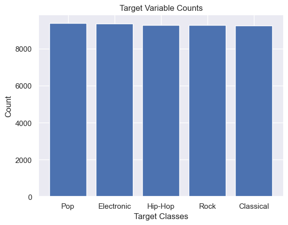
    


Targets are balanced, this means that I don't need to use sampling methods.

### 1st Model: Logistic Regression


```python
# Creating a pipeline that includes preprocessing and logistic regression
pipe_log = Pipeline([('preprocessing',preprocessor),('logreg',LogisticRegression())])

# Fitting the pipeline on the training data
pipe_log.fit(X_train, y_train)

# Printing the mean validation score of the pipeline
print("Validation score: ", cross_val_score(pipe_log,X_train,y_train).mean())
```

    Validation score:  0.7560870898497394


```python
# Defining a hyperparameter grid for logistic regression
para_log = {
    'logreg__penalty': ['l1', 'l2'], 
    'logreg__C': [0.001, 0.01, 0.1, 1, 10],
    'logreg__fit_intercept': [True, False],
    'logreg__solver': ['sag','saga'],
    'logreg__max_iter': [1000, 5000, 10000,15000],
    'logreg__tol': [1e-4, 1e-5],
    'logreg__class_weight': [None, 'balanced'],
}
```


```python
# Defining a GridSearchCV object to search for the best hyperparameters for the pipeline with the hyperparamater grid.
gs_pipe = GridSearchCV(estimator=pipe_log, param_grid=para_log,cv=5,scoring='accuracy', n_jobs = -1)

# Fitting the GridSearchCV object on the training data
gs_pipe.fit(X_train,y_train)

# Printing validation score and best hyperparemeters.
print("Validation score: ", gs_pipe.best_score_)
print("Best hyperparameters: ", gs_pipe.best_params_)
```

    Validation score:  0.7567003986507206
    Best hyperparameters:  {'logreg__C': 0.1, 'logreg__class_weight': 'balanced', 'logreg__fit_intercept': True, 'logreg__max_iter': 1000, 'logreg__penalty': 'l1', 'logreg__solver': 'saga', 'logreg__tol': 0.0001}


0.75 not bad for validation, hyperparameter tuning didn't made a huge effect.


```python
# Creating pickle files to save the best score, paramenters and estimator.
with open('logreg_gridsearch_best_score.pkl', 'wb') as f:
    pickle.dump(gs_pipe.best_score_, f)

with open('logreg_gridsearch_best_params.pkl', 'wb') as f:
    pickle.dump(gs_pipe.best_params_, f)

with open('logreg_gridsearch_best_estimators.pkl', 'wb') as f:
    pickle.dump(gs_pipe.best_estimator_, f)
```

### 2nd Model: K Nearest Neighbors


```python
# Creating a pipeline that includes preprocessing and KNN
pipe_knn = Pipeline([('preprocessing',preprocessor),('knn',KNeighborsClassifier())])

# Fitting the pipeline on the training data
pipe_knn.fit(X_train, y_train)

# Printing the mean validation score of the pipeline
print("Validation score: ", cross_val_score(pipe_knn,X_train,y_train).mean())
```

    Validation score:  0.6888377798221403


```python
# Defining a hyperparameter grid for KNN
knn_grid = { 'knn__n_neighbors': [13, 15, 18],
            'knn__p': [1, 2],
            'knn__leaf_size': [5,10]}

```


```python
# Defining a GridSearchCV object to search for the best hyperparameters for the pipeline with the hyperparamater grid
gs_pipe_knn = GridSearchCV(estimator=pipe_knn, param_grid=knn_grid,n_jobs=-1,scoring='accuracy', cv=5)

# Fitting the GridSearchCV object on the training data
gs_pipe_knn.fit(X_train,y_train)

# Printing validation score and best hyperparemeters
print("Validation score: ", gs_pipe_knn.best_score_)
print("Best hyperparameters: ", gs_pipe_knn.best_params_)
```

    Validation score:  0.7241030358785648
    Best hyperparameters:  {'knn__leaf_size': 5, 'knn__n_neighbors': 18, 'knn__p': 1}


With hyperparameter tuning the score improved by 0.04

### 3rd Model: Random Forest


```python
# Creating a pipeline that includes preprocessing and Random Forest Classifier
pipe_rf = Pipeline([('preprocessing',preprocessor),('rf',RandomForestClassifier())])

# Fitting the pipeline on the training data
pipe_rf.fit(X_train, y_train)

# Printing the mean validation score of the pipeline
print("Validation score: ", cross_val_score(pipe_rf,X_train,y_train).mean())
```

    Validation score:  0.7318307267709292


```python
# Defining a hyperparameter grid for RF
rf_grid = {
    'rf__n_estimators': [100, 200],
    'rf__criterion': ['gini', 'entropy'],
    'rf__max_depth': [5, 10],
    'rf__min_samples_split': [2, 5],
    'rf__class_weight': ['balanced', 'balanced_subsample']
}

```


```python
# Defining a GridSearchCV object to search for the best hyperparameters for the pipeline with the hyperparamater grid
rf_pipe_gs = GridSearchCV(estimator=pipe_rf, param_grid=rf_grid,n_jobs=-1,scoring='accuracy', cv=5)

# Fitting the GridSearchCV object on the training data
rf_model = rf_pipe_gs.fit(X_train,y_train)

# Printing validation score and best hyperparemeters
print("Validation score: ", rf_pipe_gs.best_score_)
print("Best hyperparameters: ", rf_pipe_gs.best_params_)
```

    Validation score:  0.76261882858019
    Best hyperparameters:  {'rf__class_weight': 'balanced', 'rf__criterion': 'gini', 'rf__max_depth': 10, 'rf__min_samples_split': 5, 'rf__n_estimators': 200}


With hyperparameter tuning the score improved by 0.03

### 4th Model: Decision Tree Classifier


```python
# Creating a pipeline that includes preprocessing and Decision Tree Classifier
pipe_dt = Pipeline([('preprocessing',preprocessor),('dt',DecisionTreeClassifier())])

# Fitting the pipeline on the training data
dt_model = pipe_dt.fit(X_train, y_train)

# Printing the mean validation score of the pipeline
print("Validation score: ", cross_val_score(pipe_dt,X_train,y_train).mean())
```

    Validation score:  0.6523765716038026


```python
# Defining a hyperparameter grid for Decision Tree
dt_grid = {
    'dt__criterion': ['gini', 'entropy'],
    'dt__splitter': ['best', 'random'],
    'dt__max_depth': [5, 10, 15],
    'dt__min_samples_split': [2, 5, 10],
}

```


```python
# Defining a GridSearchCV object to search for the best hyperparameters for the pipeline with the hyperparamater grid
dt_pipe = GridSearchCV(estimator=pipe_dt, param_grid=dt_grid,n_jobs=-1,scoring='accuracy', cv=5)

# Fitting the pipeline on the training data
dt_model = dt_pipe.fit(X_train,y_train)

# Printing validation score and best hyperparemeters
print("Validation score: ", dt_pipe.best_score_)
print("Best hyperparameters: ", dt_pipe.best_params_)
```

    Validation score:  0.7333946642134315
    Best hyperparameters:  {'dt__criterion': 'gini', 'dt__max_depth': 10, 'dt__min_samples_split': 2, 'dt__splitter': 'best'}


Hyperparameter tuning gave more improvement compared to other models, improvements is 0.08 this time.

### 5th Model: XGB


```python
# Creating a pipeline that includes preprocessing and XG Boosting
pipe_xgb = Pipeline([('preprocessing',preprocessor),('xgb', XGBClassifier(use_label_encoder=False,eval_metric = 'mlogloss',verbosity = 0, silent=True,))])

# Creating a label enocoder for target variables, XGB requires target variables to be encoded numerically
label = preprocessing.LabelEncoder()

# Fitting the encoder to create numerical targets
y_train1 = label.fit_transform(y_train)
y_test1 = label.transform(y_test)

# Printing the mean validation score of the pipeline
print("Validation score: ", cross_val_score(pipe_xgb,X_train,y_train1).mean())

```

    Validation score:  0.7532965348052745


```python
# Defining a hyperparameter grid for XGB
xgb_grid = {
    "xgb__n_estimators": [10, 50, 100],
    "xgb__subsample":[0.6, 0.8, 1],
    "xgb__learning_rate":[0.01, 0.1, 0.5, 1],
    "xgb__gamma":[0.01, 0.1, 1, 5]
}
```


```python
# Defining a GridSearchCV object to search for the best hyperparameters for the pipeline with the hyperparamater grid
xgb_pipe = GridSearchCV(estimator=pipe_xgb, param_grid=xgb_grid,n_jobs=-1,scoring='accuracy', cv=5)

# Fitting the pipeline on the training data
xgb_model = xgb_pipe.fit(X_train,y_train1)

# Printing validation score and best hyperparemeters
print("Validation score: ", xgb_pipe.best_score_)
print("Best hyperparameters: ", xgb_pipe.best_params_)
```

    Validation score:  0.7777982214044772
    Best hyperparameters:  {'xgb__gamma': 5, 'xgb__learning_rate': 0.1, 'xgb__n_estimators': 100, 'xgb__subsample': 0.8}


```python
# Creating pickle files to save the best score, paramenters and estimator.
with open('xgb_gridsearch_best_score.pkl', 'wb') as f:
    pickle.dump(xgb_pipe.best_score_, f)

with open('xgb_gridsearch_best_params.pkl', 'wb') as f:
    pickle.dump(xgb_pipe.best_params_, f)

with open('xgb_gridsearch_best_est.pkl', 'wb') as f:
    pickle.dump(xgb_pipe.best_estimator_, f)  
```

Although hyperparameter tuning haven't made a huge difference XG Boost has the best validation score so far.

### 6th Model: Gradient Boosting


```python
# Creating a pipeline that includes preprocessing and Gradient Boosting
pipe_gb = Pipeline([('preprocessing',preprocessor),('gb', GradientBoostingClassifier())])
# Fit the pipeline on the training data
pipe_gb.fit(X_train, y_train)

print("Validation score: ", cross_val_score(pipe_gb,X_train,y_train).mean())
```

    Validation score:  0.775283655320454


```python
# Defining a hyperparameter grid for Gradient Boosting
gb_grid = {
    'gb__learning_rate': [0.05, 0.1, 0.2],
    'gb__n_estimators': [50, 100, 150],
    'gb__max_depth': [3,4,5]
}
```


```python
# Defining a GridSearchCV object to search for the best hyperparameters for the pipeline with the hyperparamater grid
gb_pipe = GridSearchCV(estimator=pipe_gb, param_grid=gb_grid,n_jobs=-1,scoring='accuracy', cv=5)

# Fitting the pipeline on the training data
gb_model = gb_pipe.fit(X_train,y_train)

# Printing validation score and best hyperparemeters
print("Validation score: ", gb_pipe.best_score_)
print("Best hyperparameters: ", gb_pipe.best_params_)
```

    Validation score:  0.7752529898804048
    Best hyperparameters:  {'gb__learning_rate': 0.1, 'gb__max_depth': 3, 'gb__n_estimators': 100}


Pretty good validation score, hyperparameter tuning made no effect to score so it's open to improvement by different hyperparameter tuning.

### 7th Model: Model Stacking


```python
# Defining estimators as models with best hyperparameters for stacking
estimators = [
    ('gb', GradientBoostingClassifier(learning_rate= 0.1, max_depth = 3, n_estimators= 100, random_state=15)),
    ('rf', RandomForestClassifier(class_weight= 'balanced_subsample', criterion= 'entropy', max_depth= 10, min_samples_split= 5, n_estimators= 200,random_state=15)),
    ('xgb', XGBClassifier(gamma= 5,learning_rate= 0.1, n_estimators= 100, subsample= 0.8))
]

# Defining Stacking Classifier
sr = StackingClassifier(estimators)
```


```python
# Creating a pipeline with preprocessing step and model stacking
stacked = Pipeline([('preprocessing',preprocessor), ('model', sr)])
```


```python
# Fitting the train data to pipeline
stacked.fit(X_train, y_train)
```


    Pipeline(steps=[('preprocessing',
                     ColumnTransformer(remainder='passthrough',
                                       transformers=[('cat',
                                                      OneHotEncoder(handle_unknown='ignore'),
                                                      ['key', 'mode']),
                                                     ('scl', StandardScaler(),
                                                      ['acousticness',
                                                       'danceability',
                                                       'duration_ms', 'energy',
                                                       'instrumentalness',
                                                       'liveness', 'loudness',
                                                       'speechiness', 'tempo',
                                                       'valence',
                                                       'popularity'])])),
                    ('model',
                     StackingClassifier(es...
                                                                   grow_policy=None,
                                                                   importance_type=None,
                                                                   interaction_constraints=None,
                                                                   learning_rate=0.1,
                                                                   max_bin=None,
                                                                   max_cat_threshold=None,
                                                                   max_cat_to_onehot=None,
                                                                   max_delta_step=None,
                                                                   max_depth=None,
                                                                   max_leaves=None,
                                                                   min_child_weight=None,
                                                                   missing=nan,
                                                                   monotone_constraints=None,
                                                                   n_estimators=100,
                                                                   n_jobs=None,
                                                                   num_parallel_tree=None,
                                                                   predictor=None,
                                                                   random_state=None, ...))]))])


```python
# Checking validation score for stacked model
stacked.score(X_train, y_train)
```


    0.80754369825207


Best validation score I received among all models is from stacked model.

### Model Comparison
From all the models so far, I check the validation scores and pick the ones with best validation score. 
Now I will compare how they do on test data.

Let's compare train and test results for each model to which one does the best.


```python
#Best estimator for Gradient Boosting
bestgb = gb_pipe.best_estimator_
#Test data accuracy score 
y_pred_test_gb = bestgb.predict(X_test)
gbtestscore = accuracy_score(y_test, y_pred_test_gb)
#Train data accuracy score
y_pred_train_gb = bestgb.predict(X_train)
gbtrainscore = accuracy_score(y_train, y_pred_train_gb)

#Best estimator for XG Boost
bestxgb = xgb_pipe.best_estimator_
#Test data accuracy score
y_pred_test_xgb = bestxgb.predict(X_test)
xgbtestscore = accuracy_score(y_test1, y_pred_test_xgb)
#Train data accuracy score
y_pred_train_xgb = bestxgb.predict(X_train)
xgbtrainscore = accuracy_score(y_train1, y_pred_train_xgb)

#Best estimator for Random Forest
bestrf = rf_pipe_gs.best_estimator_
#Test data accuracy score
y_pred_test_rf = bestrf.predict(X_test)
rftestscore = accuracy_score(y_test, y_pred_test_rf)
#Train data accuracy score
y_pred_train_rf = bestrf.predict(X_train)
rftrainscore = accuracy_score(y_train, y_pred_train_rf)

#Best estimator for Logistic Regression
bestlr = gs_pipe.best_estimator_
#Test data accuracy score
y_pred_test_lr = bestlr.predict(X_test)
lrtestscore = accuracy_score(y_test, y_pred_test_lr)
#Train data accuracy score
y_pred_train_lr = bestlr.predict(X_train)
lrtrainscore = accuracy_score(y_train, y_pred_train_lr)

#Model stacking test data accuracy score
y_pred_test_stacked = stacked.predict(X_test)
stackedtestscore = accuracy_score(y_test, y_pred_test_stacked)
#Train data accuracy score
y_pred_train_stacked = stacked.predict(X_train)
stackedtrainscore = accuracy_score(y_train, y_pred_train_stacked)

```


```python
#Printing train and test accuracy scores for top models.

print("Gradient Boosting test score:", gbtestscore)
print("Gradient Boosting train score:", gbtrainscore)

print("RF test score:", rftestscore )
print("RF train score:", rftrainscore)

print("XG Boost test score:", xgbtestscore)
print("XG Boost train score:", xgbtrainscore)

print("Logistic Regression test score:", lrtestscore )
print("Logistic Regression train score:", lrtrainscore )

print("Stacked test score: ", stackedtestscore)
print("Stacked train score: ", stackedtrainscore)
```

    Gradient Boosting test score: 0.7736834573554665
    Gradient Boosting train score: 0.7981294081570071
    RF test score: 0.7605895821408128
    RF train score: 0.8024225697638762
    XG Boost test score: 0.774756725815684
    XG Boost train score: 0.8065317387304508
    Logistic Regression test score: 0.758943903835146
    Logistic Regression train score: 0.758295001533272
    Stacked test score:  0.77389811104751
    Stacked train score:  0.80754369825207


XG Boost has the best test score among all models for the target metric, accurracy. There is no variation between scores so there is no overfitting or underfitting.

### Final Model: XG Boost


```python
# Creating a pipeline that includes preprocessing and XG Boosting final model
final_model = Pipeline([('preprocessing',preprocessor),('xgb', XGBClassifier( gamma= 5,learning_rate= 0.1, n_estimators= 100, subsample= 0.8,use_label_encoder=False))])

#Creating a label enocoder for target variables, XGB requires target variables to be encoded numerically
label = preprocessing.LabelEncoder()

#Fitting the encoder to create numerical targets
y_train1 = label.fit_transform(y_train)
y_test1 = label.transform(y_test)

# Fitting the final model on the training data
final_model.fit(X_train,y_train1)

# Printing the final accuracy score
y_pred = final_model.predict(X_test)
print("Final Accuracy Score", accuracy_score(y_test1, y_pred))
```

    Final Accuracy Score 0.774756725815684


```python
# Creating a confusion matrix to visualize the classification results
ConfusionMatrixDisplay.from_estimator(final_model,X_test, y_test1)
plt.grid(False)
```


    
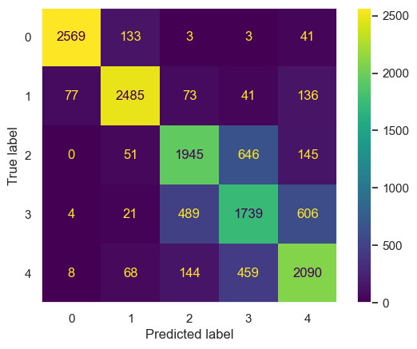
    


#### Best Predictors For Genre Classification
So far I found the best model for genre classification and now it's time to find a solution to one of the business problems.
What are the best predictors for song genre classification? 


```python
# Extracting feature importances from final model
importances = final_model.named_steps['xgb'].feature_importances_

# Creating a sorted list for feature by importance
xgb_final_model = final_model.named_steps['xgb']
feature_names = final_model.named_steps['preprocessing'].get_feature_names_out()
feature_importances = [(feature, importance) for feature, importance in zip(feature_names, importances)]
feature_importances = sorted(feature_importances, key=lambda x: x[1], reverse=True)
```


```python
# Plotting a figure to visualize top 5 features
plt.figure(figsize=(10, 8))
plot_importance(xgb_final_model, importance_type='gain', show_values=False, max_num_features=5, height=0.5)
plt.title('Feature Importances')
plt.show()
```


    <Figure size 1000x800 with 0 Axes>


    
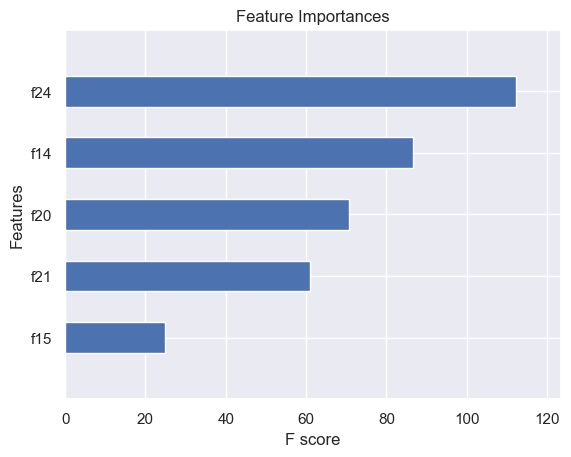
    


```python
feature_importances[:5]
```


    [('scl__popularity', 0.2313346),
     ('scl__acousticness', 0.17851314),
     ('scl__loudness', 0.14584436),
     ('scl__speechiness', 0.1258695),
     ('scl__danceability', 0.051165085)]


Most important features are:

1. Popularity
2. Acousticness
3. Loudness
4. Speechiness
5. Danceability

Now, let's create visualizations to understand the differences between genres according to top 5 feature.


```python
#Creating a new dataframe with top 5 features for classifying genre
df_numeric_top5 = df_numeric.drop(columns=['duration_ms', 'energy','instrumentalness', 'liveness', 'tempo','valence'])
```


```python
# Creating a ridgeplot for popularity by genre
data = plt.figure()
joyplot(data=df_numeric_top5, by='genre' ,column=['popularity'])
plt.title('Popularity')
plt.show
```


    <function matplotlib.pyplot.show(close=None, block=None)>


    <Figure size 640x480 with 0 Axes>


    
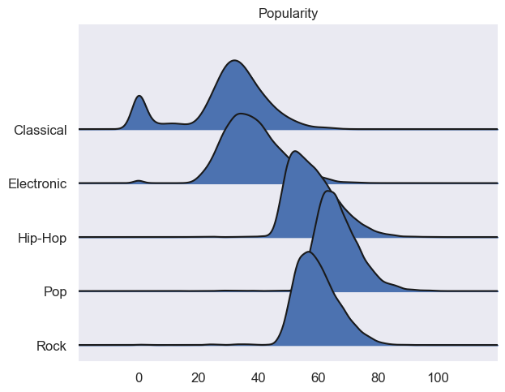
    


```python
# Creating a ridgeplot for acousticness and danceability by genre
data = plt.figure()
joyplot(data=df_numeric_top5, by='genre', column=['acousticness', 'danceability'])
plt.title('Acousticness & Danceability')
plt.show
```


    <function matplotlib.pyplot.show(close=None, block=None)>


    <Figure size 640x480 with 0 Axes>


    
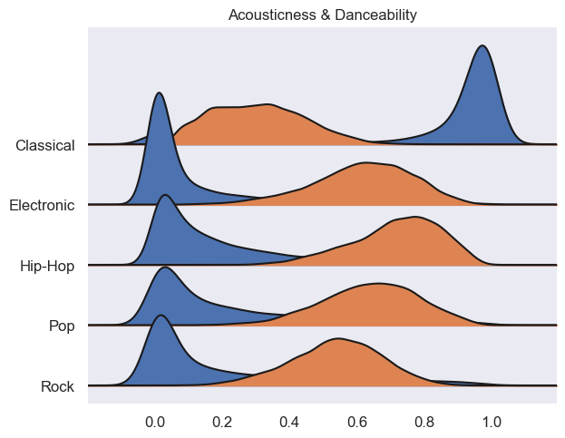
    


```python
# Creating a ridgeplot for speechiness by genre
data = plt.figure()
joyplot(data=df_numeric_top5, by='genre', column=['speechiness'])
plt.title('Speechiness')
plt.show
```


    <function matplotlib.pyplot.show(close=None, block=None)>


    <Figure size 640x480 with 0 Axes>


    
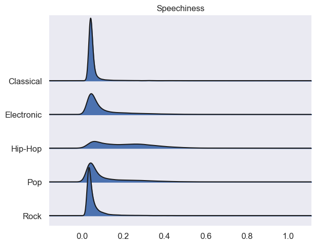
    


```python
# Creating a ridgeplot for loudness by genre
data = plt.figure()
joyplot(data=df_numeric_top5, by='genre', column=['loudness'])
plt.title('Loudness')
plt.show
```


    <function matplotlib.pyplot.show(close=None, block=None)>


    <Figure size 640x480 with 0 Axes>


    
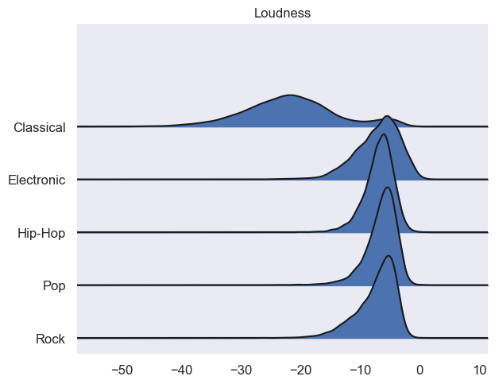
    


## Project Summary

This project aimed to develop a song genre classifier using Spotify dataset. The project included an exploratory data analysis phase, followed by the creation of baseline models and more advanced models using pipelines and grid searches. The performance of these models was evaluated on a hold-out test set, and the best-performing model was identified for genre classification.

After investigating the data, the 26 genres were filtered to 13 broad genres, and then reduced to the top 5 most popular genres. Six different pipelines were created with different classifiers, and hyperparameter tuning was used to improve the accuracy scores. The XG Boost model was identified as the best model for genre classification with an accuracy score of 0.774.

The project also identified the best predictors for song genre classification as popularity, acousticness, loudness, speechiness, and danceability. Visualizations were created to understand the differences between genres according to these features.

Overall, the project successfully developed a song genre classifier that can be used by East Village Productions to classify their new songs into different genres in the best way possible and provided insights into which features should be targeted to maximize profits.
